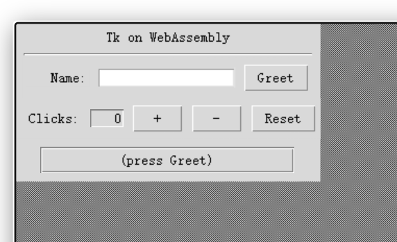

# Tcldide

⚠️ This project is in early development and is not yet stable. Expect breaking changes and missing features.

A WebAssembly build of Tcl/Tk 8.6 that runs real Tk programs in the browser.



Built on top of [Wacl](https://github.com/ecky-l/wacl); Tk's X11 calls are handled by the sibling project [em-x11](https://github.com/DevScholar/em-x11).

# Prerequisites

- Linux
- Emscripten (latest emsdk recommended; `emcc` must be on `PATH`)
- Node.js ≥ 20, pnpm ≥ 9
- make, autoconf, wget
- [em-x11](https://github.com/DevScholar/em-x11) cloned as a sibling directory and built (`pnpm install && pnpm build:native`)

# Quick start

```bash
pnpm install        # downloads Tcl/Tk sources, builds static archives
pnpm build:native   # compiles tcldide-runtime.wasm
pnpm dev            # starts Vite dev server
```

`pnpm install` will detect whether em-x11 is present and built — if not, it prints instructions and exits.

# Build

```bash
pnpm build:native
```

# Run

```bash
pnpm dev
```

# Documentation

[docs/api.md](docs/api.md)

# License

BSD 3-Clause.
